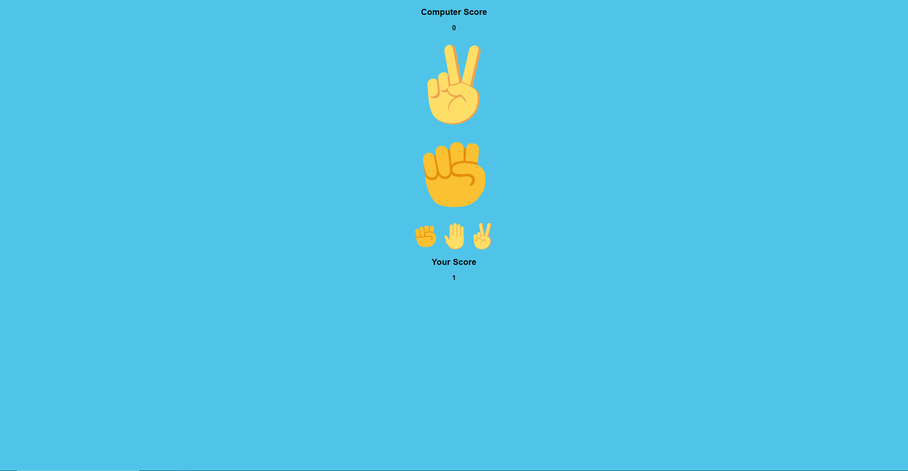

# Rock Paper Scissors

## Project Portfolio 2

Rock-paper-scissors is a hand game usually played by two people, where players simultaneously form one of three shapes with an outstretched hand. The "rock" beats scissors, the "scissors" beat paper and the "paper" beats rock; if both players throw the same shape, the game is tied. Other names for the game in the English-speaking world include roshambo, and other orderings of the three items. 

# UX

- There is one button for rock, which is a closed fist

- There is one button for paper, which is a flat hand

- there is one button for scissors, which is a closed hand with two finger forming a V,

- Under the 3 buttons, there is the player counter score which increment by 1 every time we beat the computer.

- above the three button, there is a space dedicated to player choice, at the start it will be blank, it's gonna fill as soon as player chooses either rock, paper or scissors.

- on the top there is the computer counter score which increment by 1 every time computer beats player.

- under computer scoore there is a space dedicated to computer choice, at the start it will be blank, it's gonna fill simultaneously with player choice, choosing randomly between rock paper or scissors.

- Once the user has pressed one of the control buttons, the code will generate a random number between 0 and 2 to reflect the computers choice.

- The rules are as follows:-

    - Rock beats Scissors
    - Scissors beats Paper
    - Paper beats Rock

# Main Page

When you start, the page is shown like the following, image. both computer and player choices will appear simultaneously as soon as player chooses an option between rock paper and scissors

When player chooses an option, page will look like the following image. Notice that in this image player chose rock and computer chose scissors, so rock beats scissors and player's score increased by 1.

In the following image player chose paper and computer chose scissors, so scissors beats paper and computer's score increased by 1 

## Technologies
### Languages
1.	HTML
2.	CSS
3.	JavaScript

# Testing

- I tested HTML code with W3C and got no errors

- I tested CSS code with W3C CSS Validator and got no errors

- I tested Javascript code with JS Hint and got no errors but 2 warnings

- I tested website with lighthouse and got 100 at performance

## Deployment
This website is hosted through GitHub and is deployed directly from the main branch. The deployed site will only update when new commits to the main branch have been pushed to GitHub.

### GitHub Pages
The project was deployed to GitHub Pages using the following steps:
1.	Log in to GitHub and locate the GitHub Repository
2.  Click on 'Settings'
3.  Scroll down and click on 'Pages' on the left-hand side menu.
4.  Select the 'Branch' 'master' and click on 'Save'.
5.  Allow GitHub a few minutes to deploy the website and then refresh the page.
6.  Website deployed.